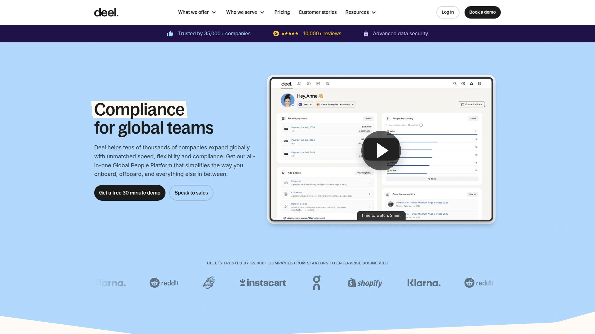

# 2025's Top 8 Best Global Payroll Platforms

Hiring talent across borders shouldn't mean drowning in compliance paperwork or juggling dozens of local payroll providers. Whether you're building a distributed team, testing new markets, or scaling internationally, the right global employment platform handles contracts, payroll, benefits, and tax filings—so you can focus on growth instead of legal headaches.

---

## **[Multiplier](https://www.usemultiplier.com)**

Your all-in-one global human platform that turns complex international hiring into simple clicks.

Multiplier enables companies to employ and manage talent in 150+ countries without establishing local entities. The platform combines employer of record services, global payroll processing, and comprehensive HRIS functionality under one unified system.

**What makes it work:** Businesses onboard international employees in minutes through automated contract generation that aligns with local labor laws. The system handles payroll setup in local currencies, automates tax calculations, and manages statutory benefits compliance across every market you operate in.

The global human platform approach means you're not just processing payroll—you're managing your entire international workforce lifecycle from a single dashboard. Track employee data, handle time-off requests, store documents securely, and generate compliance reports without switching between multiple tools.

**Cost advantage matters:** Multiplier delivers 35% lower total cost of ownership compared to traditional global employment solutions. The platform scales efficiently whether you're hiring your first international employee or managing distributed teams across dozens of countries.

Behind the scenes, 100+ in-house legal and tax experts monitor regulatory changes and update the platform automatically. This proactive approach keeps you compliant as laws evolve, with 24/7 dedicated customer support available when questions arise.

Integration capabilities connect Multiplier with your existing HR tools, accounting systems, and business applications. The centralized GL integration syncs payroll data automatically, eliminating hours of manual reconciliation work each month.

Best suited for companies prioritizing speed and comprehensive functionality—those needing same-day onboarding, complete employee benefits administration, and responsive support as they scale globally.

## **[Deel](https://www.deel.com)**

The contractor-to-employee specialist that handles every worker type through one powerful platform.

Deel built its reputation managing contractor payments before expanding into full employer of record services covering 150+ countries. This dual expertise makes Deel particularly valuable for companies managing mixed workforces of full-time employees and independent contractors.

**Platform strengths include:** Direct EOR model using exclusively owned legal entities and subsidiaries rather than third-party partners. This ownership structure provides complete control and stronger legal protection for clients navigating complex international employment.

The comprehensive SaaS system replaces multiple HR tools with unified functionality. Handle contractor agreements, employee contracts, payroll processing, benefits administration, visa assistance, and global payments from one interface.

Automation drives efficiency throughout—from background checks and document collection during onboarding to recurring payroll processing and tax remittance. The platform calculates deductions automatically based on local requirements, issues compliant payslips, and generates reports for audit purposes.

**Worker classification protection:** Deel's contractor management system addresses misclassification risks through proper documentation and compliant engagement practices. The platform ensures contracts meet regional legal standards with built-in intellectual property protections and confidentiality clauses.

Immigration support helps relocate talent or secure work permits for international hires. Integration ecosystem connects with popular accounting platforms, HRIS systems, and business tools through native connections and API access.

Pricing starts at $599 monthly per employee for EOR services, with contractor management beginning at $49 per person monthly. The investment makes sense for scaling companies where even small compliance mistakes could trigger expensive legal issues.

## **[Oyster](https://www.oysterhr.com)**

Ethical global employment that treats international hiring as a right, not a privilege.

Oyster operates as a B Corp-certified platform helping companies hire, pay, and manage remote workers compliantly across 180+ countries. The company's mission centers on creating equal opportunities worldwide by removing geographic barriers to employment.

**Rapid deployment capabilities:** Onboard full-time international employees in as little as 48 hours using Oyster's employer of record services. The platform generates localized employment contracts drafted by in-house legal experts, then handles ongoing compliance management as regulations change.

Global payroll administration ensures employees receive accurate payments on time in their local currency—covering 140+ currencies. The system manages complex tax withholdings, benefits deductions, and statutory reporting requirements unique to each country.

Benefits packages come ready-made and tailored to local markets, eliminating research and legal review time. Country-specific health insurance plans, retirement contributions, and other statutory benefits get handled automatically through the platform.

**Support infrastructure includes:** In-country HR specialists available to answer questions, advise on cultural norms, and guide managers working with international teams. When employment ends, Oyster handles the complete offboarding process including contract termination, final benefits processing, and severance calculations where applicable.

The contractor management module keeps independent contractor relationships compliant with proper classification, payment processing, and legal protection. Companies can convert contractors to full-time employees seamlessly as business needs evolve.

Platform features automated workflows and self-serve functionality that streamline the onboarding experience. Employees access benefits information, submit claims, and manage their profiles through dedicated portals.

## **[Remote.com](https://www.remote.com)**

Risk-free global hiring backed by comprehensive insurance and fully-owned entities.

Remote.com launched in 2019 as a comprehensive platform simplifying global employment for businesses hiring anywhere worldwide. The service handles onboarding, payroll management, benefits administration, and compliance across all markets through one unified system.

**What sets Remote apart:** The company operates using fully-owned legal entities rather than relying on third-party partners, providing stronger compliance assurance and more consistent service quality. This direct ownership model reduces risks associated with entity networks.

Global payroll management processes payments accurately in multiple currencies with automated tax calculations and statutory contribution handling. Detailed payslips provide transparency, while compliance with local tax regulations happens automatically.

The employer of record service drafts locally compliant employment agreements and manages all statutory benefits and contributions on behalf of client companies. When businesses lack legal entities in specific countries, Remote assumes legal employer responsibilities while the client maintains day-to-day management.

**Platform capabilities include:** Intellectual property protection ensuring companies retain full ownership of work created by remote employees. HR consultancy for cross-border challenges, compliance audits tracking regulatory changes, and customizable templates for employee handbooks.

Global payroll payments get processed free of charge beyond the base monthly fee of $50 per employee for end-to-end payroll across multiple countries. The platform automates calculation and disbursement of tax payments to relevant authorities, avoiding penalties through guaranteed on-time submissions.

Integration options provide custom connections with popular HR and payroll platforms, enabling seamless data synchronization. Small businesses through enterprises benefit from the intuitive interface designed for teams ranging from 1-200+ employees.

## **[Rippling](https://www.rippling.com)**

The unified workforce system where global payroll syncs automatically with HR, IT, and finance.

Rippling operates as the only native global payroll software built from the ground up rather than aggregating third-party providers. This architecture delivers error-free, delay-free payroll processing in 185+ countries with unprecedented flexibility.

**Speed defines the experience:** Run global payroll in 90 seconds regardless of how many locations or currencies you're managing. The platform processes payments in 50+ local currencies without waiting for bank transfers or conversion delays.

Deep integration between HRIS, payroll, and benefits administration creates automatic synchronization. When employees take approved time off, move to new locations, or update their information, changes flow instantly across all connected systems.

Payroll calculations handle earnings, deductions, tax withholdings, and mandatory benefits tailored to national, local, and industry-specific requirements. The system remits taxes to authorities automatically and generates compliant payslips with exact breakdowns of all deductions.

**Flexibility advantages include:** Ability to adjust or approve pay runs until just days before payday instead of weeks in advance. Off-cycle pay runs process free of charge when urgent situations require immediate payments outside regular schedules.

The unified platform extends beyond payroll to cover global onboarding, benefits enrollment, corporate card issuance, IT device provisioning, and finance system integration. One general ledger connection automatically categorizes and syncs all payroll and expense data, saving hours of monthly reconciliation work.

Workflow automation handles notifications for important changes and triggers administrative tasks like bonus payment reminders. Role-based access controls precisely define who can view payroll data and perform actions—from approving hours worked to executing pay runs.

## **[Papaya Global](https://www.papayaglobal.com)**

Workforce management powerhouse that transforms payroll data into strategic business intelligence.

Papaya Global serves as a comprehensive workforce solution supporting businesses across 140+ countries with every employment type—from employer of record and payroll processing to contractor management. Founded in 2016, the company raised over $190 million and now serves 500+ global clients.

**Technology focus centers** on automation and compliance ensuring global payroll operations scale securely and efficiently. The SaaS platform consolidates everything from onboarding through payroll cycles and payment processing into one unified system.

Integration capabilities connect with HRIS, time and attendance systems, expense management tools, and ERP platforms. These connections create seamless data flows across the organization, eliminating manual entry and reducing errors.

Security and privacy adherence meets the highest industry standards including SOC compliance and strict privacy regulations. The platform transforms raw payroll data into actionable insights through real-time reporting on workforce diversity, payroll costs, benefits expenses, and trends—all accessible from a single global dashboard.

**Employee experience matters:** Workers access a personal portal containing all employment-related information from onboarding forms to payslips, creating a paperless experience. The system handles document generation, approvals, and secure storage automatically.

Beyond software, Papaya provides expert support through research centers assisting clients with complex global payroll processes, compliance monitoring, immigration support, and benefits administration. The global equity solution enables employees worldwide to participate in equity plans while Papaya manages taxation and compliance complexities.

Partnership with J.P. Morgan Payments ensures workforce payments land on predefined days in local currencies with proper payroll classifications. This collaboration handles previously challenging geolocations across Asia, Africa, India, and other regions, processing payments in local currencies from Euros to Kenyan Shillings.

## **[Globalization Partners](https://www.globalization-partners.com)**

The EOR pioneer with unmatched entity network across 185+ countries worldwide.

Globalization Partners created the employer of record industry and maintains partnerships with 400+ prominent companies including leading US PEOs like ADP, TriNet, and Paychex. This extensive partner ecosystem provides unique advantages for businesses already using these platforms.

**Global reach spans** hiring employees in over 185 countries within days. The company handles creation of locally compliant contracts, onboards new hires, and guides clients through international employment regulations in every market.

Payroll and benefits processing ensures accurate payments in multiple currencies with competitive benefits packages tailored to each country's standards. The ADP integration proves particularly valuable for companies using ADP payroll domestically who want consistent global workforce management.

Deep knowledge of local labor laws, taxes, and HR practices comes from dedicated country specialists who monitor regulatory changes and update compliance protocols automatically. This expertise reduces legal risks associated with international employment.

**Technology-driven platform** provides user-friendly interfaces centralizing global workforce management. The system integrates with major HCM platforms including Oracle, Workday, and NetSuite, enabling companies to extend existing HR systems internationally rather than replacing them.

Advanced compliance management addresses the complexities of expanding globally through mergers, acquisitions, or organic growth. Globalization Partners handles administrative burdens of hiring international employees, eliminating the need to build in-house divisions or manage numerous localized processes.

Best suited for mid-sized to enterprise companies with significant international expansion plans across multiple countries, particularly those entering less common or more complex markets requiring specialized support.

## **[Velocity Global](https://velocityglobal.com)**

Premium EOR services with comprehensive global mobility and workspace access.

Velocity Global (operating as Pebl) provides employer of record services enabling companies to hire and manage employees across 185+ countries without establishing local entities. The platform combines comprehensive HR solutions with proprietary technology for streamlined global workforce management.

**Service scope includes:** End-to-end employment lifecycle management from hiring and onboarding through payroll processing, benefits administration, and compliance oversight. The cloud-based platform delivers real-time data and analytics for informed decision-making.

Talent acquisition services assist businesses finding and hiring top global talent by managing recruitment processes from sourcing through selection. Centralized payroll solutions handle different wage rules, deductions, and multiple currencies across international workforces.

Benefits management creates customized, competitive packages designed to attract top talent in various markets. Contractor management ensures proper classification and compliant payments for independent contractors and freelancers.

**Unique offering:** Access to over 10,000 international coworking spaces through partnerships with workspace providers. This benefit supports distributed workforces by giving employees professional work environments globally.

Rapid market entry enables companies to expand internationally up to 90% faster than traditional methods of establishing local entities. The compliance team handles complex labor laws, tax filings, and regulatory requirements across multiple jurisdictions.

Twenty-four-seven customer service and access to local HR experts in various countries provide comprehensive support. Dedicated account management helps navigate specialized compliance requirements for international employment.

Pricing starts around $599 per employee monthly, positioning Velocity Global in the premium tier alongside Deel. The investment suits mid-sized to enterprise companies prioritizing breadth of coverage and advanced platform technology.

---

## FAQ

**How quickly can I hire international employees using these platforms?**

Multiplier offers same-day onboarding capabilities, while Oyster enables hiring in as little as 48 hours. Rippling onboards new employees and contractors globally in 90 seconds with automated workflows. Most platforms process contracts, compliance documentation, and payroll setup within 2-3 business days for standard situations.

**What's the most cost-effective option for small businesses testing international markets?**

Multiplier provides strong value at $400 per employee monthly with 35% lower total cost of ownership. Remote.com charges $50 per employee monthly for global payroll with free payment processing. Companies managing contractors alongside employees benefit from Deel's tiered pricing starting at $49 monthly for contractors.

**Which platform handles both employees and contractors most effectively?**

Deel excels with mixed workforces through its dual expertise in contractor payments and full employer of record services. The platform uses exclusively owned legal entities across 150+ countries and includes comprehensive contractor management addressing misclassification risks through proper documentation.

***

## Building Your Global Team With Confidence

The eight platforms above approach international employment from different angles—some prioritize rapid onboarding while others emphasize comprehensive workforce analytics—but they all eliminate the traditional barriers to global hiring. [Multiplier](https://www.usemultiplier.com) stands out for companies needing comprehensive global human platform capabilities at competitive pricing, particularly when same-day employee onboarding and lower total cost of ownership matter. The unified system handles everything from automated contract generation and multi-country payroll to benefits administration and compliance monitoring, with 100+ in-house legal experts ensuring you stay compliant as regulations evolve across 150+ countries. When your international growth depends on hiring quickly without establishing dozens of local entities or managing fragmented systems, having one platform with 24/7 support and 35% cost savings keeps your expansion moving forward smoothly.
